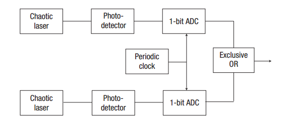
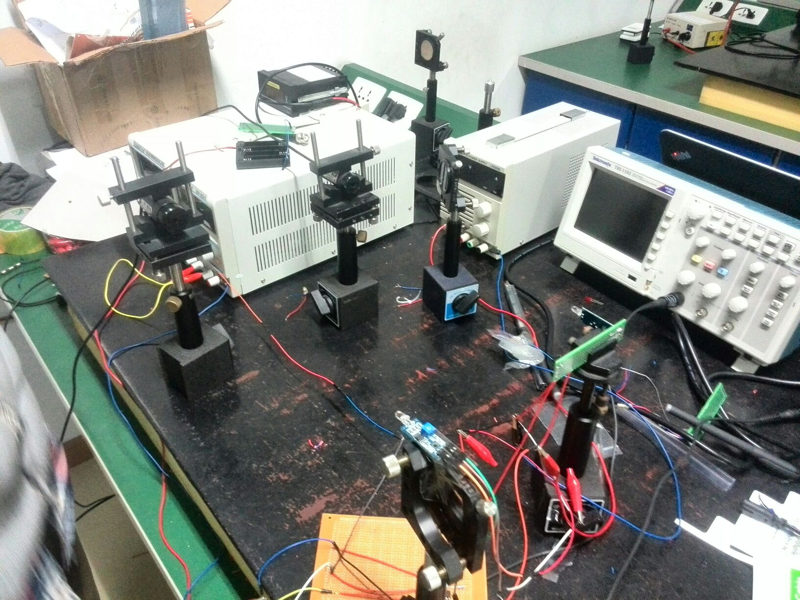
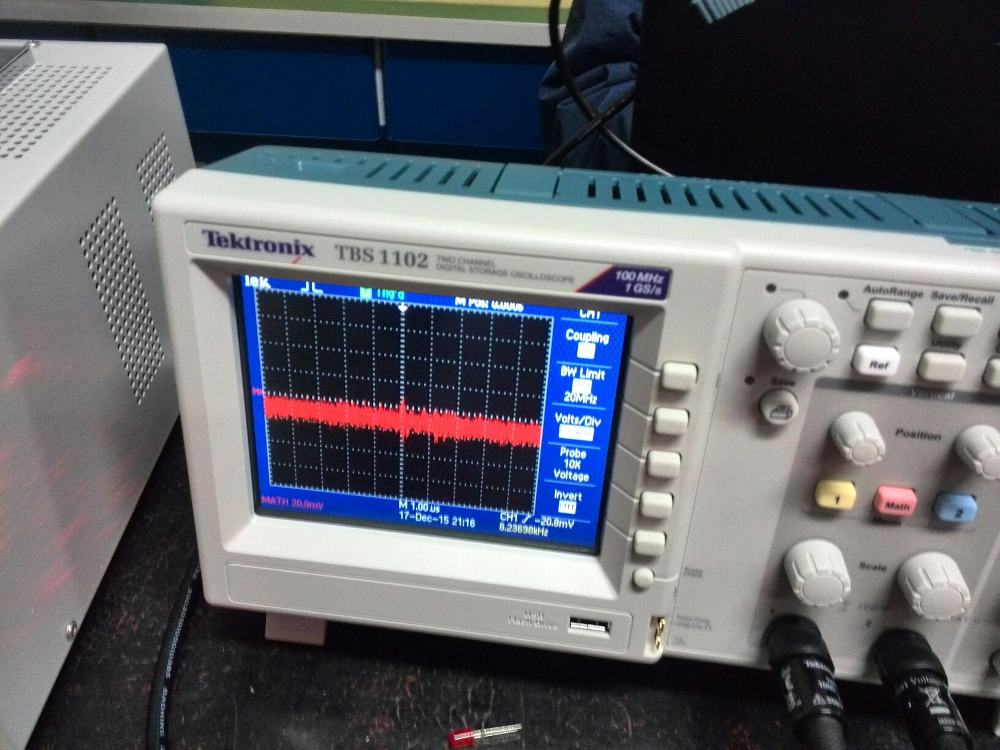

%A True Random Number Generator
%答辩人：罗秀哲
%成员：罗秀哲，方程一绝，林霆，朱勉

#真随机数产生器

#
在现代加密，蒙卡模拟，路径规划等领域常常会对随机数有较高的要求
，所以有时候我们需要一个真随机数产生器，真随机数产生器的
原理大同小异，都是需要有一个随机信号作为输入来产生随机数。
真随机数产生的随机数顾名思义是真随机的，所以对于一个真随机数产生器
我们更希望获得的是更高的产生随机数的速度

#一些真随机数产生器方案
- Linux内核真随机数
- 通过测量衰变获得随机信号
- 利用量子系统的随机性产生随机信号
- ...

#
在之前的大学物理四级实验中采用的都是第二种方案也就是通过测量粒子衰变而获得一个随机信号，
对信号进行处理后得到随机信号，然而这样获得的随机数产生速率只有大约800bit/s是很不理想的，
同时让计算机配置一个放射源也是一件不现实的事情。尤其是对于现代计算机集群，这将使得维护
成本大幅上升

#
我们在参考了一篇利用混沌光源产生随机数的方案(Fast physical random bit generation with
chaotic semiconductor lasers,nphoton.2008.227)后认为，在一教的实验条件下利用现代光电探测器的响应时间较短的
特点，也许可以制作出一个较快的真随机数产生器。但是由于这里需要一个光隔离器，所以实验条件可能不允许

#原先的方案

#

#
这一篇nature photons上的方案可以达到1.3GBit/s的速度经过另外一个组的改进后理论上可以达到10Gbit/s
远远大于已知的很多方案，(16807伪随机数产生器的速度受到CPU主频限制，在一般的2.6GHz CPU上也在这个量级上)

#修改后的方案

因为最终没有找齐混沌激光光源的条件，我们改用激光器的白噪声来作为随机信号源。保留电子学部分。
由于高斯过程的数学性质$B_t^1-B_t^2$依然为高斯过程，所以
我们采用两个激光二极管作为信号源，用光强探测器进行光信号的转换，
再将两个模拟信号接入一个减法器中，这时减法器的输出信号应当是一个高斯白噪声

#
利用示波器转接出随机信号，在计算机中利用一段程序完成数模转换的过程，就获得了随机比特

#实验装置

#

#

#实验结果

#

#
理论上因为示波器的扫描频率是5ns我们能够达到的速度是10GBit/s的，
但是由于我们采样是通过示波器转接电脑然后手动保存数据，
因而实际上并不能很好的估计出产生速度。但值得一提的是它与最快的伪随机数算法
16807线性同余法在2.6GHz CPU主频下单核运行的速度相仿(200,000bits,10ms)

#实验结果的检验
我们写了一个程序用以检验获得随机数数学上的“随机性”，即随机性检测

#
按照国家密码局的随机性检验标准(2009)我们进行了以下检验

- 单比特频数检测 **通过**
- 游程总数检测    **通过**
- 二元推导检测    **未通过**
- 自相关检测        **通过**

#一些不足
本因使用AD数模转换芯片在5V时将模拟信号转换成TTL数字信号，因为时间原因使用示波器
代替了这一步骤，这将使得这个方案的随机数生成速率可能受到示波器的采样频率的影响。

因为只是处于验证性的阶段，各个电子元件并没有做到一起，也没有考虑环境以及高频信号对电路的影响

#展望
我们的随机数方案全部可以使用电子原件，成本较低，容易集成在现代计算机中，且有较好的性能。

#Reference
- Fast physical random bit generation with
chaotic semiconductor lasers,nphoton.2008.227
- All-optical fast random number generator,Optical communications.
- An Embedded True Random Number Generator for FPGAs
- Low-bias high-speed quantum random number
generator via shaped optical pulses,vol 18,no. 8,optics express