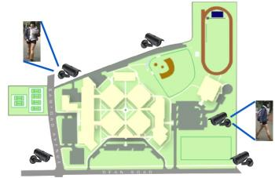
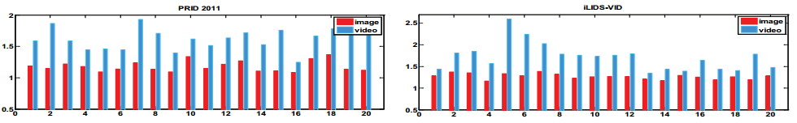
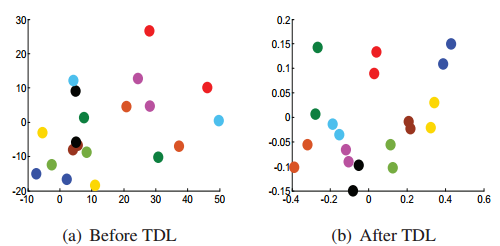
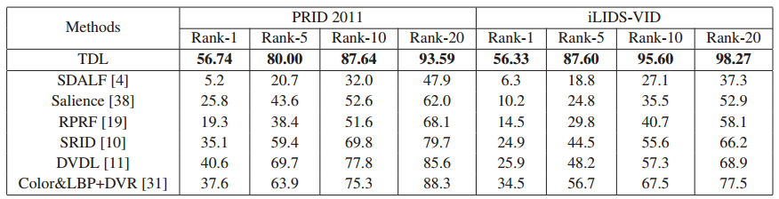
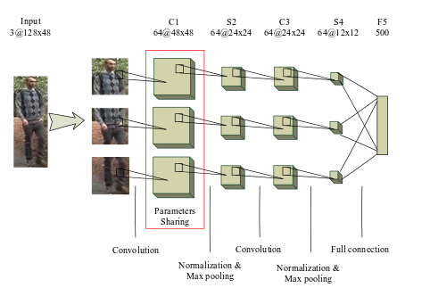
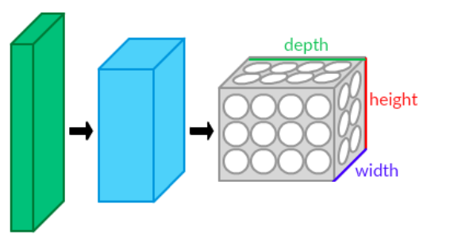
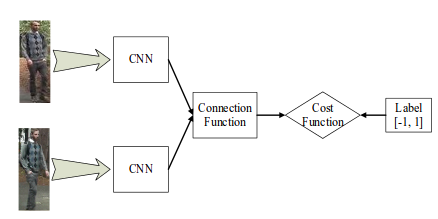

A typical application scenario of person re-identification: a network of video surveillance cameras monitoring a large public space. The girl is seen at first by the camera in the upper-left corner, then by a second camera of the network (lower-right corner). A person re-identification system should associate these views to the same identity.

# Related works

# [2016,CVPR] Top-push Video-based Person Re-identification

#

#

$$
f(D) = (1-\alpha) \sum_{x_i,x_j,y_i=y_j} D(\vec{x_i},\vec{x_j}) +\\ \alpha \sum_{x_i,x_j,y_i=y_j} \max{D(\vec{x_i},\vec{x_j})-\min_{y_k\neq y_i}D(\vec{x_i},\vec{x_k})+\rho,0}
$$

#

# Results

# Deep Metric Learning for Person Re-Identification

---

### Advantages

> - DML can learn a similarity metric from image pixels
directly. All layers in DML are optimized by the same
objective function, which are more effective than the
hand-crafted features in traditional methods.
> - The multi-channel filters learned in DML can capture
the   color   and   texture   information   simultaneously,
which  are  more  reasonable  than  the  simple  fusion
strategies in traditional methods,e.g.,feature concate-nation and sum rule.
> - The  structure  of  DML  is  flexible  that  can  easily
switch between view specific and general person re-
identification tasks by whether sharing the parameters
of sub-networks.

#

# A brief intro of CNN
In machine learning, a convolutional neural network (CNN, or ConvNet) is a type of feed-forward artificial neural network in which the connectivity pattern between its neurons is inspired by the organization of the animal visual cortex, whose individual neurons are arranged in such a way that they respond to overlapping regions tiling the visual field.

#

---

CNN works well in "sample $\rightarrow$ label" training data sets. But for person re-identification, the subjects in the training set are generally different from those in the test set. In this work, researcher introduced a siamese CNN.

---

---

connection function is used to evaluate the connection between sample pairs, candidates could be  Eu-
clidian distance, Cosine similarity, absolute difference, vector
concatenate and so on.

---

$$
\begin{aligned}
S_{euc}(x,y) &= -\sum_{i}(x_i-y_i)^2\\
S_{cos}(x,y) &= \frac{\sum_i x_i y_i}{\sqrt{\sum_i x_i x_i \sum_i y_i y_i}}\\
S_{abs}(x,y) &= -\sum_{i}|x_i-y_i|\\
S_{con}(x,y) &= \sum_{i} \omega_i [x;y]_i
\end{aligned}
$$
